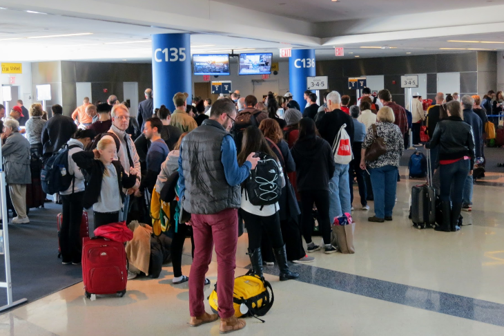
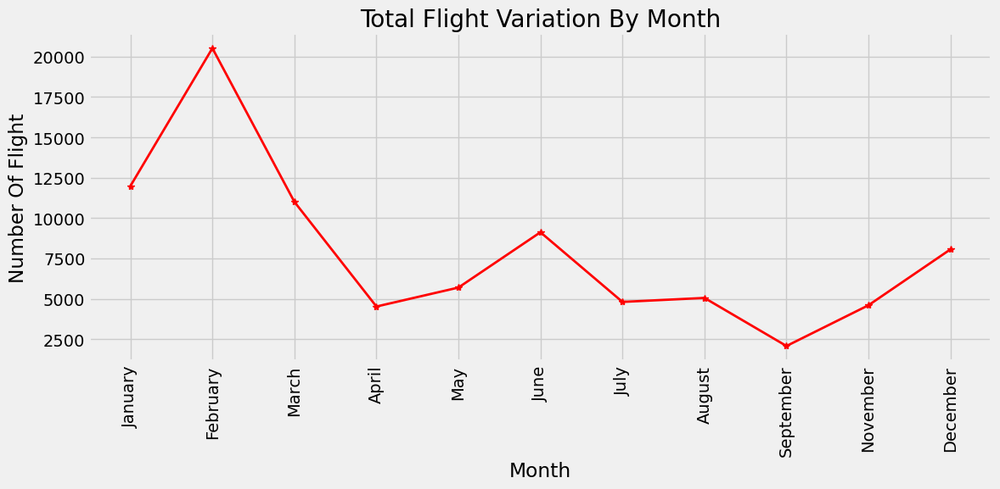
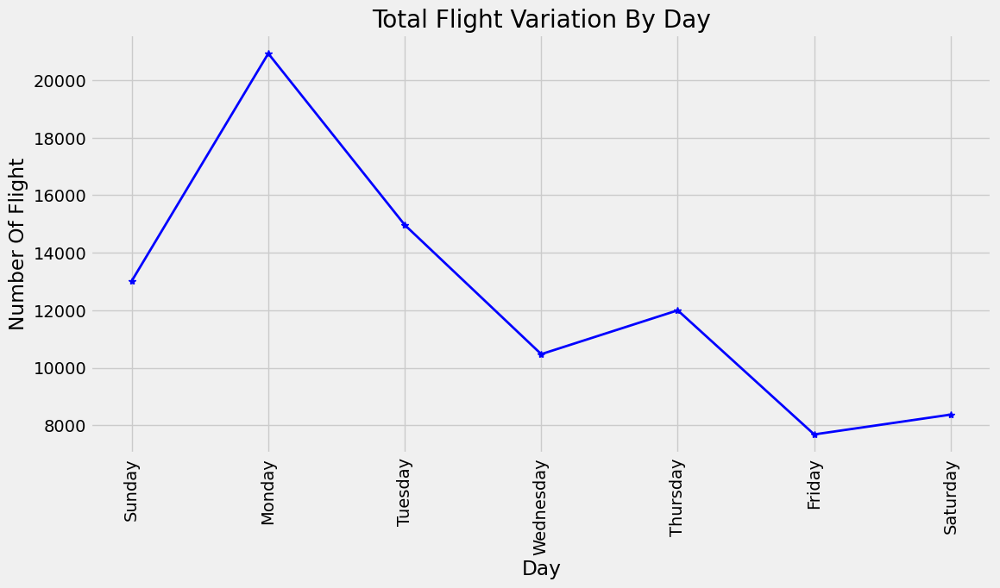
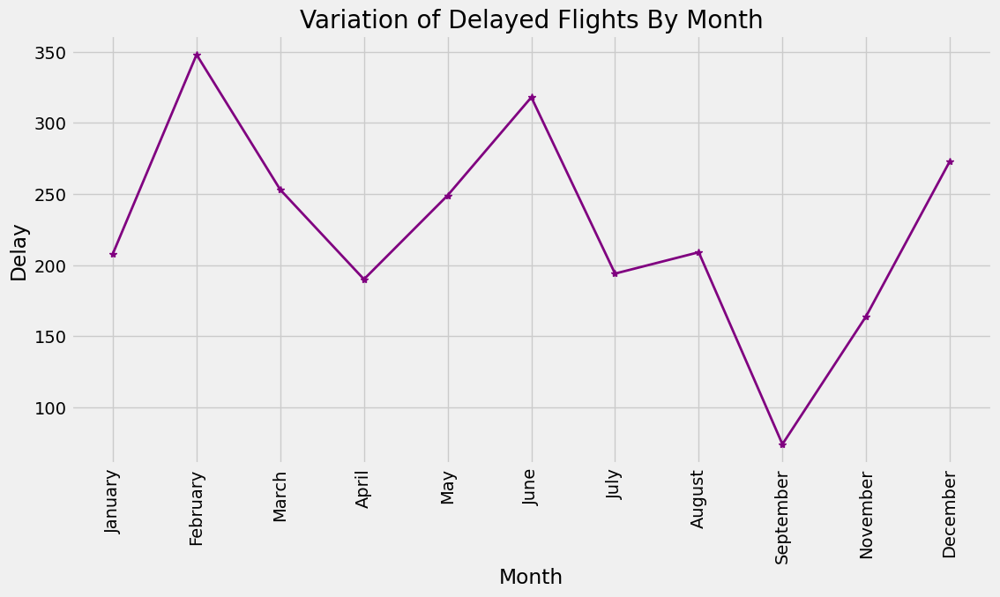
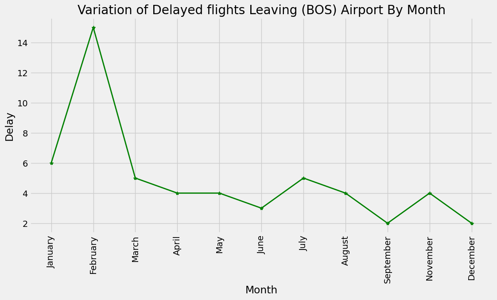
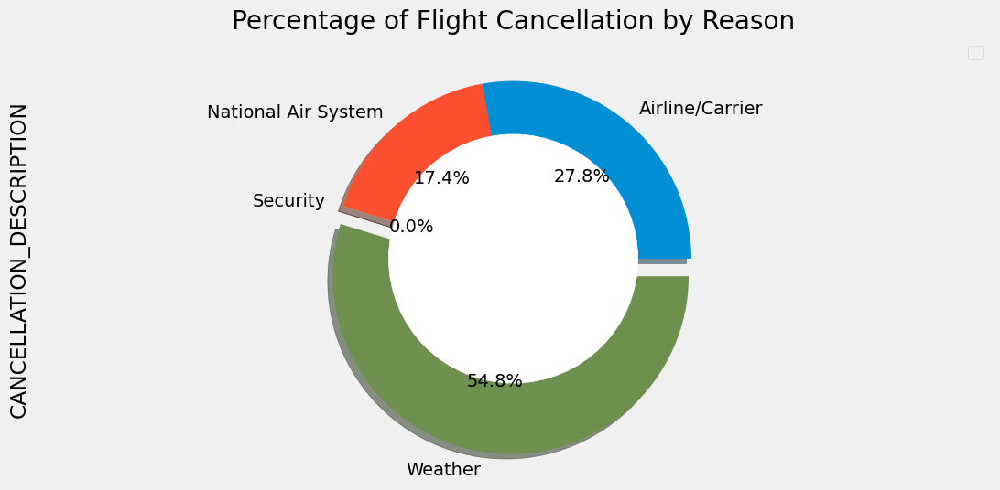
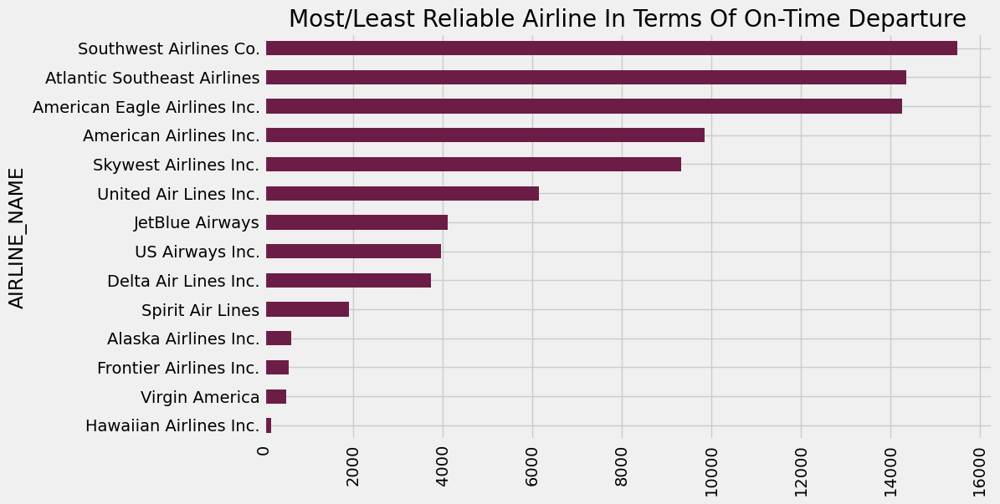

# 2015 TRAVERSE AGENCY FLIGHT DELAY ANALYSIS USING PYTHON

# TRAVERSE AGENCY INC

# Introduction:

Traverse Agency Inc (fictitious) is a renowned Travel Agency in United States of America specialized in Tourism,planning of summer vacation,boat cruise etc
for High Net Individuals (HNI) and Tourists. They are highly sort after by Airline operators in the Aviation Industry due to their volume of transactions
and Customers profile.They have within their books different Airlines that provide unique travelling experience for their numerous Customers across different 
Airport around the globe most especially in United State of America.

# Problem Statement:

Recently,there have been several complains by their Customers in terms of incessant changes in their travelling schedule due to flight cancellation,delays etc.
As a responsible Compnpany that pride itself in provideing a unique and worthwile travel experience for their Customers.

Traverse Agency embark on a review of Airline performance in their books for deep root cause analysis of the Customers complain.For a start, they have identified a couple of areas they will
like to look at from their Data.I was engaged by Traverse Agency Inc to assist in providing answers to their concerns using **PYTHON** as analytical tool for their report. 

# DataSet:
The DataSet is a CSV file with four Tables namely **Airlines**, **Airports**, **Cancellation_Codes** and **Flights**, provided by Traverve Agency Inc.

# Skills Demonstrated:
 Data cleaning and manupulative skills were deployed using the Python in-built libraries such as Pandas,Numpy,Matplotlib to transform and create visuals.

# Data Transformation/Modelling:
The Pandas library was used to read the CSV file and to merge the different Tables base on common column in the Dataset to form a consolidated
 DataFrame called df_flights. Additional columns were created and irrelevant columns were dropped.Matplotlib library was then used to create all the visuals needed.

 
 
 #  Analysis and Visualization:
 
 1. How does overall flight volumes vary by month? By day of the week?

 2. What percentage of flights-in experienced a departure delay? Among
      those flights, what was the average delay time, in minutes?

 3. How does the delayed flights vary throughout the year? What about for
      flights leaving from Boston (BOS) specifically?

 4.  How many flights were cancelled? What % of cancellations were due to
      weather? What % were due to the Airline/Carrier?

 5.  Which airlines seem to be most and least reliable, in terms of on-time departure?

#   Visualization:

# Total Flights Volume is 5,819,079

# Percentage Of Flights-In That Experience Departure Delay is 36.42%

# Average Delay Time is 0.36(Minutes)

 

# Report

Total Flights Volume is **5,819,079** with **February**  been the peak contributing **20,517**of the total while **September** with **2,075** is the lowest.

**36.42%** of Flights-In experience Departure delay with an Average delay time of **0.36(Minutes)**.

Throuhout the year,the total number of Delayed flight is **2,480** with **February** having **348**  been the highest while **September** with **74** is the lowest.

Specifically for Flights leaving Boston,the total number of Delayed flight is **54** with **February** having **15**  been the highest while **September and December** with **2** are the lowest.

Total cancelled flights is **87,430** and **54.8%** of Total cancelled flights were due to Weather while **27.8%%** were due to Airline/Carrier.

In terms of reliability, **SouthWest Airlines Co**  with **15,501** flights On-Time departure,seems to be the most reliable Airline.
However,  **Hawaiian Airlines Inc**  with **1,531** Flights On-Time departure,seems to be the least reliable Airline.
 .

The full Report of the Analysis is a Click away on the Read me file as PDF:

# Conclusion/Recommendation:

Whilst a **54.8%** Flight cancellation seems to be too high, however, due to the fact that it is attributed to unfavorable weather which noone has
control. However a **27.8%%** due to Airline/Carrier is a testatament to complaint by the Customers.I suggest an wholistic review of Airlines 
operational efficiency.

The management of Traverse should engage  **Hawaiian Airlines Inc** to understand their challenges in meeting up with their flight schedule or outright
removal from their books.

Customers should be advise to plan their travelling outside the month of **February** has that seems to the month with most cancellation.
